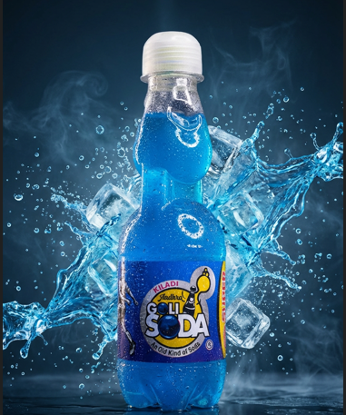

# 🍾 Andhra Goli Soda

*(Replace with an actual screenshot or banner if available)*

**Andhra Goli Soda** is a modern, responsive landing page and e-commerce frontend built for a heritage beverage brand. It blends nostalgic aesthetics with high-performance web technologies to deliver a premium digital experience.

---

## 🚀 Tech Stack

* **Framework:** [React](https://react.dev/) + [Vite](https://vitejs.dev/) (High-performance tooling)
* **Styling:** [Tailwind CSS](https://tailwindcss.com/) (Utility-first styling)
* **Animations:** [Framer Motion](https://www.framer.com/motion/) (Smooth scroll & entrance animations)
* **Icons:** [Lucide React](https://lucide.dev/)
* **Language:** TypeScript / JavaScript

---

## ✨ Key Features

* **🌊 Immersive Hero Section:** Auto-playing video background or smooth image slider with seamless cross-fades and parallax effects.
* **🛒 Shopping Cart Logic:** Fully functional `CartContext` with "Add to Cart," quantity adjustments, and a slide-out drawer that only opens on user interaction.
* **📱 Fully Responsive:** Optimized mobile navigation with a hamburger menu and touch-friendly interactions.
* **🎨 "Aqua Frost" & "Ocean Deep" Theme:** Custom gradients and glassmorphism (glass-card) effects to match the brand's refreshing vibe.
* **🖼️ Brand Story Collage:** A unique, floating image collage layout powered by Framer Motion animations.
* **⚓ Smooth Scrolling:** Custom smooth scroll behavior that enables navigation without cluttering the URL with hash fragments.

